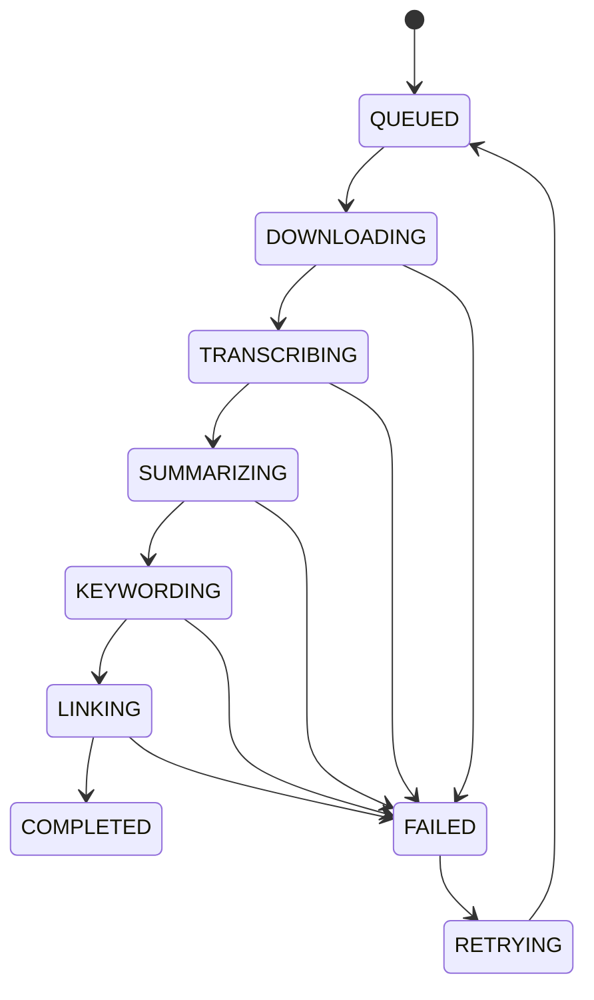

# Mock JSON 与状态流转图

## 1. 前端联调 Mock JSON 示例
### 1.1 创建任务（URL）
```json
{
  "source_type": "url",
  "source_url": "https://example.com/video.mp4",
  "title": "演示视频标题",
  "mode": "brief",
  "style": "popular_science",
  "language": "auto",
  "return_formats": ["srt", "vtt", "json"]
}
```

响应
```json
{
  "task_id": "task_123",
  "status": "queued",
  "message": "processing started"
}
```

### 1.2 创建任务（本地路径）
```json
{
  "source_type": "path",
  "source_path": "/Users/yourname/Videos/demo.mp4",
  "title": "演示视频标题",
  "mode": "brief",
  "style": "popular_science",
  "language": "auto",
  "return_formats": ["srt", "vtt", "json"]
}
```

### 1.3 状态查询
```json
{
  "task_id": "task_123",
  "status": "processing",
  "stage": "transcribing",
  "progress": 0.38,
  "eta_sec": 15,
  "error": null
}
```

### 1.4 结果查询
```json
{
  "video_meta": {
    "duration_sec": 1560,
    "format": "mp4",
    "video_type": "Technology"
  },
  "summary": {
    "fast": "...",
    "full": "...",
    "segments": [
      {"start_ms": 0, "end_ms": 60000, "summary": "..."}
    ]
  },
  "subtitles": [
    {"index": 1, "start": "00:00:01,000", "end": "00:00:04,000", "text": "..."}
  ],
  "annotations": [
    {
      "term": "XGBoost",
      "segment_id": "seg_04",
      "start_ms": 120000,
      "end_ms": 130000,
      "importance": 0.82,
      "explanation_short": "...",
      "explanation_long": "...",
      "sources": [{"title": "...", "url": "..."}],
      "context_blob": "..."
    }
  ]
}
```

### 1.5 失败示例
```json
{
  "task_id": "task_123",
  "status": "failed",
  "stage": "transcribing",
  "error": "ASR timeout"
}
```

## 2. 状态流转图

