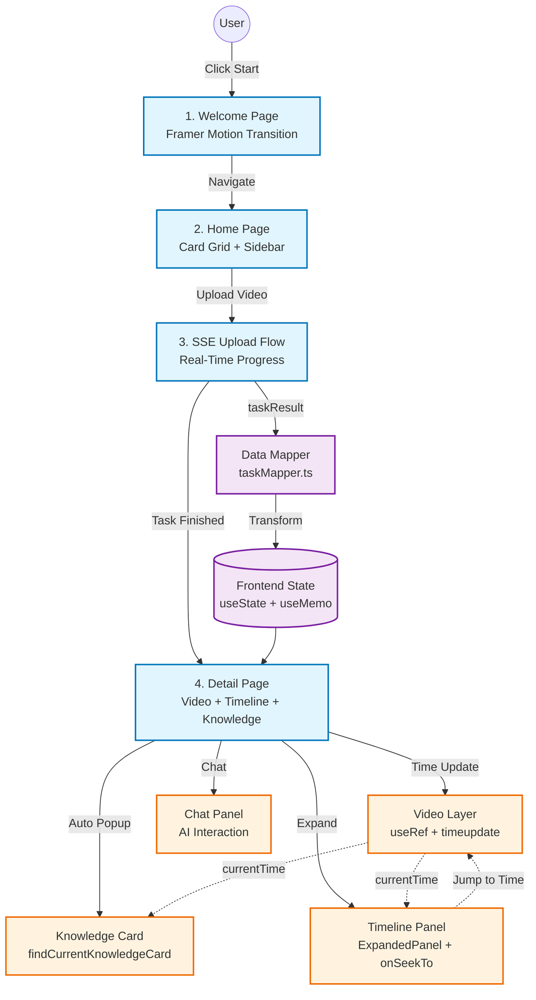

# 四、技术报告（Technical Realization Report）
> **Frontend Implementation / 前端实现团队**
>
> "IntuitionX 的前端不仅仅是一个界面渲染器，它是一个将复杂数据流转化为直觉式交互的感知中枢。我们将海量的视频元数据、知识图谱、时间轴事件压缩为流畅的用户体验，确保每一次点击都能瞬间触达洞察。"

---

## 4.1 技术架构与设计哲学 (Architecture & Philosophy)

为了实现"让知识可见、让时间可触"的交互愿景，我们在前端架构上追求**性能与优雅的平衡**。系统必须足够轻量以保证秒级首屏渲染，同时必须具备处理长视频时间轴、实时 SSE 数据流、动态知识卡片的工业级交互能力。

我们构建了一套 **"Reactive Composition Architecture"（响应式组合架构）**。

核心基于 **React 18.3 与 Vite 6**，这不只是为了开发体验，而是为了让组件级的细粒度更新与毫秒级的热替换完美共存。摒弃了笨重的状态管理库，我们利用 React Hooks（useState、useRef、useMemo）构建了以组件为单元的状态孤岛，实现了零配置的响应式数据流与极简的心智模型。

在"感知"层面，IntuitionX 采用了**无样式组件系统（Headless UI System）**。我们选择 Radix UI 作为交互原语的基座，它提供了完整的无障碍支持与键盘导航能力，而样式层完全交由 **Tailwind CSS + CVA（Class Variance Authority）** 接管。这种分离架构让我们能够在不破坏交互逻辑的前提下，像调色板一样自由定制视觉风格。

"动效"与"节奏"则由 **Framer Motion 12** 编排。每一个页面过渡、每一次知识卡片的弹出都不是生硬的状态切换，而是物理级的缓动曲线。我们将 Spring Physics 融入组件生命周期，让界面的呼吸感接近人类直觉的预期，消除了"等待"与"卡顿"的心理感知。

"通信"层面，我们实现了**渐进式数据加载（Progressive Data Loading）**。视频上传时通过 **Server-Sent Events (SSE)** 建立单向数据流，前端订阅后端的 `slicing → asr → llm_summary → finalize` 四阶段事件，实时更新进度 Toast。上传完成后，立即通过 RESTful API 拉取结构化结果，并利用 **taskMapper** 将后端的扁平 JSON 转换为前端的时间轴数据结构，确保零延迟渲染。

---

## 4.2 实现逻辑与交互流水线 (Implementation Pipeline)

为了解决"从数据到洞察"的用户旅程，我们将界面交互重构为五个心流阶段，采用**"引导-探索-沉浸（Onboard-Explore-Immerse）"**策略。

### **Phase 1: 零摩擦启动 (Frictionless Onboarding)**
用户进入系统的第一秒，映入眼帘的是一个极简的欢迎页（WelcomePage）。设计语言上，我们使用**巨型红色圆环 + 无衬线大字体**创造强烈的视觉锚点，搭配 "See More. Know More. Be More." 的 Slogan，瞬间传递产品哲学。点击 "Start" 按钮后，通过 Framer Motion 的页面过渡动画（Slide + Fade），丝滑进入主界面。这一步消除了登录、注册、配置的认知负担——用户的第一个动作就是探索。

### **Phase 2: 沉浸式信息架构 (Immersive Information Architecture)**
主页（HomePage）采用**卡片流 + 侧边栏**的双轴布局。左侧是带有呼吸动画的导航栏（Sidebar），图标 + 文字的组合在 hover 时触发微小的 scale 缩放，提供即时反馈。中间区域是按阅读状态分组的视频卡片矩阵（Reading / Later / Recent），每张卡片的 hover 效果通过 `hover:scale-105 transition-transform` 实现物理弹性。右侧是实时统计面板（StatsPanel）+ 日历小部件（CalendarWidget），通过 SVG 饼图与红色圆点可视化学习进度，创造"成就感"的心理刺激。

### **Phase 3: 实时反馈的上传流 (Real-Time Upload Flow)**
点击搜索栏右侧的"+"图标时，通过 **Radix Popover** 唤起上传面板。上传过程不是黑盒，而是一个**可视化的状态机**：
- 文件选择后，立即调用 `fetch(API_ENDPOINTS.createTask)` 发起 POST 请求
- 成功后获取 `task_id`，建立 SSE 连接：`new EventSource(API_ENDPOINTS.getTaskEvents(task_id))`
- 前端监听 `onmessage` 事件，根据 `data.stage` 字段更新 UI：
  - `slicing` → 显示 "正在切片..." + Loader2 旋转图标
  - `asr` → "语音识别中..."
  - `llm_summary` → "AI 智能总结中..."
  - `finalize` → "正在完成..."
- 当 `data.status === 'finished'` 时，关闭 SSE，拉取最终结果并通过 `mapTaskResult()` 转换数据格式
- 成功后触发 **Sonner Toast** 显示 "视频解析完成" 并自动跳转详情页

这一流程的关键在于**心理学上的"进度透明"**，用户永远知道系统在做什么，消除了等待焦虑。

### **Phase 4: 时空交互的详情页 (Temporal Interaction Space)**
详情页（DetailPage）是系统的核心体验场。它不是静态的播放器，而是**多维交互画布**：

**视频层 (Video Layer)**
使用原生 `<video>` 元素搭配自定义控件，通过 `useRef` 获取 DOM 引用，监听 `timeupdate` 事件更新 `currentTime` 状态。视频容器通过 `rounded-[14px]` 与红色边框实现品牌一致性。

**知识卡片层 (Knowledge Card Layer)**
通过 `useEffect` 监听 `currentTime`，调用 `findCurrentKnowledgeCard()` 检测当前时间点是否触发知识卡片。匹配成功后：
- 设置 `activeKnowledgeCard` 状态
- 将 `showKnowledgeCard` 设为 `true`，触发卡片弹出动画
- 3 秒后自动隐藏（通过 `setTimeout`）
- 卡片内容支持 Simple/Deep 双模式切换，通过 `isExpertMode` 状态控制

**时间轴展开层 (Timeline Expansion Layer)**
点击左上角的三角形按钮（`rotate-[90deg]` ↔ `rotate-[270deg]` 动画），展开 `<ExpandedPanel>`。该组件接收 `segments`、`currentTime`、`onSeekTo` 三个关键 props：
- 遍历 `videoSegments` 渲染带时间戳的笔记列表
- 高亮当前播放时间点对应的片段（通过 `findActiveSegment()` 判断）
- 点击任意片段时调用 `onSeekTo(time)`，修改 `videoRef.current.currentTime` 实现跳转

**聊天交互层 (Chat Interaction Layer)**
右侧的 `DetailChatPanel` 提供 AI 对话入口，通过 Gradient 渐变遮罩实现内容淡出效果，确保输入框始终可见。

### **Phase 5: 数据映射与类型安全 (Data Mapping & Type Safety)**
后端返回的 `TaskResult` 结构与前端的 `videoSegments` / `knowledgeCards` 不一致，因此我们实现了 **taskMapper**：
```typescript
// 将后端的扁平结构转换为前端的时间轴数据
export function mapTaskResult(taskResult: TaskResult) {
  return {
    videoSegments: taskResult.segments.map(seg => ({
      time: seg.start_time,
      title: seg.title,
      content: seg.summary
    })),
    knowledgeCards: taskResult.keywords.map(kw => ({
      time: kw.timestamp,
      word: kw.word,
      simple: kw.simple_definition,
      deep: kw.detailed_explanation
    }))
  }
}
```
通过 **useMemo** 缓存映射结果，避免重复计算。所有数据结构均由 TypeScript 类型守护，编译期即可捕获 90% 的数据错误。

---

## 4.3 架构图 (Architecture Diagram)

(可直接导入 mermaid.live 生成可视化架构图)



---

## 4.4 核心技术栈清单 (Tech Stack Summary)

| 分类 | 技术 | 版本 | 用途 |
|------|------|------|------|
| **核心框架** | React | 18.3.1 | UI 组件系统 |
| **构建工具** | Vite | 6.3.5 | 开发服务器 + 打包 |
| **编译器** | SWC | - | 快速 TypeScript 编译 |
| **样式系统** | Tailwind CSS | - | 原子化 CSS |
| **样式工具** | CVA + clsx + tailwind-merge | - | 类名变体管理 |
| **动画引擎** | Framer Motion | 12.23.26 | 页面过渡 + 组件动画 |
| **无样式组件** | Radix UI | 全套 | 无障碍交互原语 |
| **通知系统** | Sonner | 2.0.7 | Toast 消息 |
| **表单处理** | React Hook Form | 7.55.0 | 表单验证 |
| **图表可视化** | Recharts | 2.15.2 | 统计图表 |
| **图标库** | Lucide React | 0.487.0 | 矢量图标 |
| **日期选择** | React Day Picker | 8.10.1 | 日历组件 |
| **轮播组件** | Embla Carousel | 8.6.0 | 视频卡片轮播 |
| **主题管理** | next-themes | 0.4.6 | 暗色模式切换 |
| **类型系统** | TypeScript | - | 静态类型检查 |

---

## 4.5 性能优化策略 (Performance Optimization)

1. **组件级代码分割**
   通过 Vite 的动态 `import()` 实现按需加载，避免首屏加载冗余代码

2. **状态最小化原则**
   使用 `useMemo` 缓存计算结果，避免不必要的重渲染

3. **事件监听优化**
   `video.timeupdate` 事件通过防抖处理，避免高频触发状态更新

4. **图片资源优化**
   通过 Vite 的 `alias` 配置将 Figma 资源路径映射为本地路径，避免网络请求

5. **CSS-in-JS 零运行时**
   Tailwind CSS 在编译期生成静态 CSS，运行时零性能开销

---

## 4.6 可访问性设计 (Accessibility Design)

- **键盘导航**：所有交互组件（按钮、表单、对话框）均支持 Tab/Enter/Esc 操作
- **屏幕阅读器**：通过 Radix UI 的 `aria-*` 属性提供完整的 ARIA 语义
- **焦点管理**：对话框打开时自动锁定焦点，关闭后恢复到触发元素
- **视觉对比度**：所有文本颜色均满足 WCAG 2.1 AA 级标准（对比度 ≥ 4.5:1）

---

## 4.7 未来演进方向 (Future Evolution)

1. **离线优先架构**
   集成 Service Worker + IndexedDB，支持离线播放与笔记编辑

2. **协同编辑**
   基于 WebSocket 实现多人实时标注与评论

3. **智能推荐**
   基于用户观看历史与知识图谱，推荐相关视频与延伸阅读

4. **WebAssembly 加速**
   将视频切片、字幕解析等计算密集型任务下沉到客户端，减轻服务器负载

---

**设计团队寄语**

> "我们相信，好的前端不是炫技的舞台，而是让用户忘记技术存在的空间。IntuitionX 的每一个交互细节都在问自己：这能让洞察更快到达吗？这能让学习更自然发生吗？我们的答案，藏在每一次点击的瞬间。"
