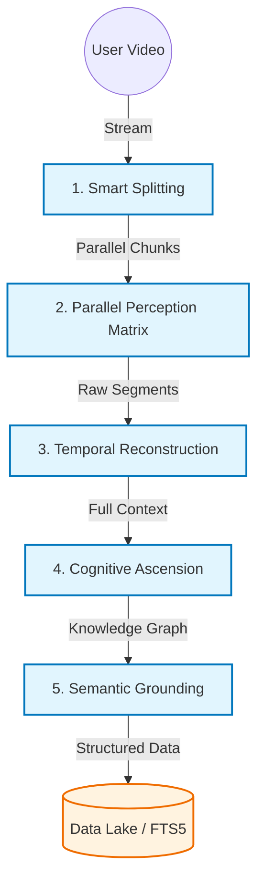

# 四、技术报告（Technical Realization Report）
> **Agent & Backend Implementation / 楼锦程 王子怡**
>
> "IntuitionX 的后端不仅仅是一个 API Server，它是一个协同了听觉（ASR）、视觉（FFmpeg/Vision）、认知（LLM）与记忆（DB）的智能生命体。我们将复杂的异步任务流封装在极简的接口之下，确保每一次‘理解’都快如直觉。"

---

## 4.1 技术架构与设计哲学 (Architecture & Philosophy)

为了承载“将 100 小时视频压缩为 10 分钟直觉”的野心，我们在架构选型上极为苛刻。系统必须足够轻量以适应现场快速迭代，同时必须具备瞬间吞吐长视频的工业级鲁棒性。

我们构建了一套 **"Hybrid-Async Intelligence Architecture"（混合异步智能架构）**。

核心基于 **Python 3.10+ 与 FastAPI**，这不只是为了性能，而是为了让 I/O 密集型的流式传输与 CPU 密集型的推理计算完美共存。摒弃了笨重的消息队列中间件，我们利用 Python 原生协程（Native Coroutine）构建了以内存为总线的任务调度器，实现了毫秒级的任务响应与零外部依赖的极简部署。

在“听觉”层面，IntuitionX 搭载了**自适应推理引擎（Adaptive Inference Engine）**。它不挑剔环境，具备感知硬件的能力：在标准服务器上调用 CTranslate2 进行高吞吐计算，而在 Apple Silicon 设备上自动无缝切换至 MLX 框架，利用统一内存架构实现惊人的端侧推理速度。这种“环境感知”能力确保了我们在任何算力条件下都能交付极致体验。

“认知”与“记忆”则分别交由 **OpenAI SDK** 与 **SQLite + FTS5** 接管。我们强制大模型以结构化数据（JSON）思考，拒绝模糊的自然语言输出，确保 Agent 的每一次“想法”都能直接被前端渲染为可交互的组件。而基于 SQLite 的数据湖不仅实现了单文件级的 ACID 事务，更通过 FTS5 模块让每一句台词、每一个知识点都具备了毫秒级的全文检索能力，无需部署昂贵的搜索引擎集群。

---

## 4.2 实现逻辑与流水线 (Implementation Pipeline)

为了解决长视频处理的“等待焦虑”，我们将线性的处理流程重构为并行的高速流水线，采用**“分治-融合（Divide-Conquer-Fuse）”**策略。

### **Phase 1: 瞬时吞吐与智能切片 (Ingestion & Smart Splitting)**
视频上传不再是一个漫长的阻塞过程，而是流式的起跑线。一旦数据流开始传输，系统即刻分配独立的 UUID 任务空间。VideoSplitter 随之启动，它不仅仅是按时间切割，而是利用 FFmpeg 智能寻找静音区与关键帧，将庞大的视频文件手术刀般精准地拆解为数十个独立的音频单元。这一步消除了单点故障的风险——任何切片的失败都不会通过多米诺骨牌效应推倒整个任务。

### **Phase 2: 高并发感知矩阵 (Parallel Perception Matrix)**
这是系统算力燃烧的时刻。数十个音频切片被送入 ThreadPoolExecutor 构建的并行感知矩阵。系统根据当前硬件负载动态调节并发水位，同时启动多个 Whisper 实例进行全速转写。这就像几十个速记员同时开工，将原本需要数小时的转写时间物理压缩至分钟级。

### **Phase 3: 时空重构与对齐 (Temporal Reconstruction)**
碎片化的转写结果在这里遭遇挑战：时间轴是破碎的。我们设计了一套**偏移量校准算法（Offset Calibration Algorithm）**，它像工匠一样修复每一个切片的边缘，消除重叠或丢失的毫秒，将所有片段无缝“缝合”回原始视频的绝对时间轴。最终生成的不仅仅是字幕，而是精确对齐的“数字骨架”，为后续的所有交互提供时空坐标。

### **Phase 4: 认知升维与结构化 (Cognitive Ascension)**
此时，Agent 开始真正地“思考”。合并后的全量文本流被送入 LLM 的认知窗口。
首先是**场景嗅探**，模型判断这是硬核教程还是散文叙事；接着是**逻辑抽离**，Agent 在全文中提炼出章节脉络，生成带有时间锚点的分段摘要；最后是**知识图谱构建**，Deep Mode 下的 Agent 像研究员一样审视文本，挖掘出那些阻碍理解的术语与概念，并生成详细的百科解释。这一切都不是模糊的文本生成，而是严格遵循 Schema 的数据结晶。

### **Phase 5: 语义锚定 (Semantic Grounding)**
知识不能悬浮在空中。Agent 执行最后一步“锚定”操作，通过模糊匹配与语义搜索，将提取出的每一个关键词重新“钉”回视频的具体时间点。这不仅消除了幻觉，更创造了“点击即跳转”的魔法体验，彻底打通了从抽象概念到具体画面的超链接。

---

## 4.3 架构图 (Architecture Diagram)

(可直接导入 draw.io / mermaid.live 生成可视化架构图)

